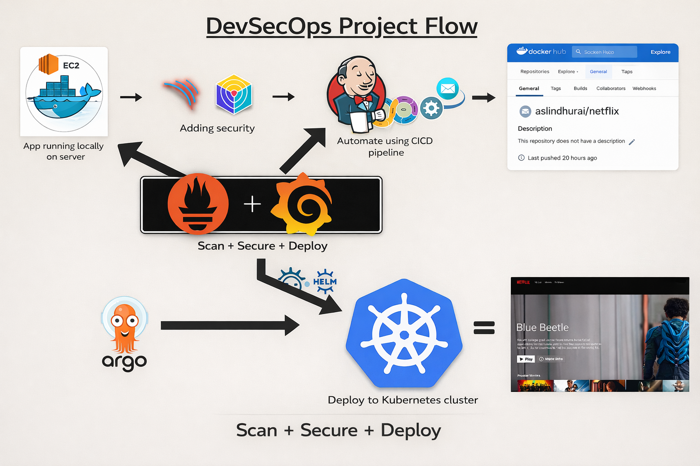

<div align="center">
  
  <br>
  <a href="http://netflix-clone-with-tmdb-using-react-mui.vercel.app/">
    
  </a>
</div>

<br />

<div align="center">
  
  <p align="center">Home Page</p>
</div>

# Deploy Netflix Clone on Cloud using Jenkins (DevSecOps Project)

## Tutorial

Refer to the official project walkthrough/documentation for a full setup.

---

## Phase 1: Initial Setup and Deployment

### 1) Launch EC2 (Ubuntu 22.04)

- Provision an EC2 instance with Ubuntu 22.04.
- Connect via SSH.

### 2) Clone the Repository

```bash
git clone https://github.com/AslinDhurai/DevSecOps-Project.git
```

### 3) Install Docker and Run the App Container

Install Docker:

```bash
sudo apt-get update
sudo apt-get install docker.io -y
sudo usermod -aG docker $USER
newgrp docker
sudo chmod 777 /var/run/docker.sock
```

Build and run container:

```bash
docker build -t netflix .
docker run -d --name netflix -p 8081:80 netflix:latest

# cleanup
docker stop <containerid>
docker rmi -f netflix
```

If the app shows an API error, generate and pass your TMDB key.

### 4) Get TMDB API Key

1. Login/Register at TMDB.
2. Go to Profile → Settings → API.
3. Create API key and submit details.
4. Rebuild image with key:

```bash
docker build --build-arg TMDB_V3_API_KEY=<your-api-key> -t netflix .
```

---

## Phase 2: Security

### 1) Install SonarQube and Trivy

Run SonarQube:

```bash
docker run -d --name sonar -p 9000:9000 sonarqube:lts-community
```

Access SonarQube:

- `http://<public-ip>:9000`
- Default credentials: `admin / admin`

Install Trivy:

```bash
sudo apt-get install wget apt-transport-https gnupg lsb-release
wget -qO - https://aquasecurity.github.io/trivy-repo/deb/public.key | sudo apt-key add -
echo deb https://aquasecurity.github.io/trivy-repo/deb $(lsb_release -sc) main | sudo tee -a /etc/apt/sources.list.d/trivy.list
sudo apt-get update
sudo apt-get install trivy
```

Scan image:

```bash
trivy image <imageid>
```

### 2) Integrate SonarQube

- Connect SonarQube in Jenkins.
- Configure project analysis and quality gate.

---

## Phase 3: CI/CD Setup (Jenkins)

### 1) Install Jenkins (with Java)

```bash
sudo apt update
sudo apt install fontconfig openjdk-17-jre
java -version

sudo wget -O /usr/share/keyrings/jenkins-keyring.asc \
https://pkg.jenkins.io/debian-stable/jenkins.io-2023.key
echo deb [signed-by=/usr/share/keyrings/jenkins-keyring.asc] \
https://pkg.jenkins.io/debian-stable binary/ | sudo tee \
/etc/apt/sources.list.d/jenkins.list > /dev/null
sudo apt-get update
sudo apt-get install jenkins
sudo systemctl start jenkins
sudo systemctl enable jenkins
```

Access Jenkins:

- `http://<public-ip>:8080`

### 2) Install Required Jenkins Plugins

Go to **Manage Jenkins → Plugins → Available Plugins** and install:

1. Eclipse Temurin Installer
2. SonarQube Scanner
3. NodeJS Plugin
4. Email Extension Plugin
5. OWASP Dependency-Check
6. Docker-related plugins:
   - Docker
   - Docker Commons
   - Docker Pipeline
   - Docker API
   - docker-build-step

### 3) Configure Global Tools

Go to **Manage Jenkins → Tools**:

- Install JDK 17
- Install NodeJS 16
- Install Sonar Scanner tool
- Configure OWASP Dependency-Check as `DP-Check`

### 4) Add Credentials

Go to **Manage Jenkins → Credentials**:

- Add Sonar token as Secret Text (e.g. `Sonar-token`)
- Add DockerHub credentials (ID used in pipeline: `docker`)

### 5) Example Jenkins Pipeline

```groovy
pipeline {
    agent any
    tools {
        jdk 'jdk17'
        nodejs 'node16'
    }
    environment {
        SCANNER_HOME = tool 'sonar-scanner'
    }
    stages {
        stage('clean workspace') {
            steps {
                cleanWs()
            }
        }
        stage('Checkout from Git') {
            steps {
                git branch: 'main', url: 'https://github.com/AslinDhurai/DevSecOps-Project.git'
            }
        }
        stage("Sonarqube Analysis") {
            steps {
                withSonarQubeEnv('sonar-server') {
                    sh '''$SCANNER_HOME/bin/sonar-scanner -Dsonar.projectName=Netflix \
                    -Dsonar.projectKey=Netflix'''
                }
            }
        }
        stage("quality gate") {
            steps {
                script {
                    waitForQualityGate abortPipeline: false, credentialsId: 'Sonar-token'
                }
            }
        }
        stage('Install Dependencies') {
            steps {
                sh "npm install"
            }
        }
    }
}
```

### 6) Extended Pipeline (Security + Docker + Deploy)

```groovy
pipeline{
    agent any
    tools{
        jdk 'jdk17'
        nodejs 'node16'
    }
    environment {
        SCANNER_HOME=tool 'sonar-scanner'
    }
    stages {
        stage('clean workspace'){
            steps{
                cleanWs()
            }
        }
        stage('Checkout from Git'){
            steps{
                git branch: 'main', url: 'https://github.com/AslinDhurai/DevSecOps-Project.git'
            }
        }
        stage("Sonarqube Analysis "){
            steps{
                withSonarQubeEnv('sonar-server') {
                    sh ''' $SCANNER_HOME/bin/sonar-scanner -Dsonar.projectName=Netflix \
                    -Dsonar.projectKey=Netflix '''
                }
            }
        }
        stage("quality gate"){
           steps {
                script {
                    waitForQualityGate abortPipeline: false, credentialsId: 'Sonar-token'
                }
            }
        }
        stage('Install Dependencies') {
            steps {
                sh "npm install"
            }
        }
        stage('OWASP FS SCAN') {
            steps {
                dependencyCheck additionalArguments: '--scan ./ --disableYarnAudit --disableNodeAudit', odcInstallation: 'DP-Check'
                dependencyCheckPublisher pattern: '**/dependency-check-report.xml'
            }
        }
        stage('TRIVY FS SCAN') {
            steps {
                sh "trivy fs . > trivyfs.txt"
            }
        }
        stage("Docker Build & Push"){
            steps{
                script{
                   withDockerRegistry(credentialsId: 'docker', toolName: 'docker'){
                       sh "docker build --build-arg TMDB_V3_API_KEY=<yourapikey> -t netflix ."
                       sh "docker tag netflix aslindhurai/netflix:latest "
                       sh "docker push aslindhurai/netflix:latest "
                    }
                }
            }
        }
        stage("TRIVY"){
            steps{
                sh "trivy image aslindhurai/netflix:latest > trivyimage.txt"
            }
        }
        stage('Deploy to container'){
            steps{
                sh 'docker run -d --name netflix -p 8081:80 aslindhurai/netflix:latest'
            }
        }
    }
}
```

If Docker login fails in Jenkins agent:

```bash
sudo su
sudo usermod -aG docker jenkins
sudo systemctl restart jenkins
```

---

## Phase 4: Monitoring (New EC2 Machine)

**Note:** Set up monitoring on a **separate/new EC2 instance** (Ubuntu 22.04) instead of the Jenkins machine.

### 1) Install Prometheus

Create user and download:

```bash
sudo useradd --system --no-create-home --shell /bin/false prometheus
wget https://github.com/prometheus/prometheus/releases/download/v2.47.1/prometheus-2.47.1.linux-amd64.tar.gz
```

Extract and place files:

```bash
tar -xvf prometheus-2.47.1.linux-amd64.tar.gz
cd prometheus-2.47.1.linux-amd64/
sudo mkdir -p /data /etc/prometheus
sudo mv prometheus promtool /usr/local/bin/
sudo mv consoles/ console_libraries/ /etc/prometheus/
sudo mv prometheus.yml /etc/prometheus/prometheus.yml
sudo chown -R prometheus:prometheus /etc/prometheus/ /data/
```

Create service file:

```bash
sudo nano /etc/systemd/system/prometheus.service
```

Use:

```ini
[Unit]
Description=Prometheus
Wants=network-online.target
After=network-online.target

StartLimitIntervalSec=500
StartLimitBurst=5

[Service]
User=prometheus
Group=prometheus
Type=simple
Restart=on-failure
RestartSec=5s
ExecStart=/usr/local/bin/prometheus \
  --config.file=/etc/prometheus/prometheus.yml \
  --storage.tsdb.path=/data \
  --web.console.templates=/etc/prometheus/consoles \
  --web.console.libraries=/etc/prometheus/console_libraries \
  --web.listen-address=0.0.0.0:9090 \
  --web.enable-lifecycle

[Install]
WantedBy=multi-user.target
```

Enable and start:

```bash
sudo systemctl enable prometheus
sudo systemctl start prometheus
sudo systemctl status prometheus
```

Access:

- `http://<your-server-ip>:9090`

### 2) Install Node Exporter

```bash
sudo useradd --system --no-create-home --shell /bin/false node_exporter
wget https://github.com/prometheus/node_exporter/releases/download/v1.6.1/node_exporter-1.6.1.linux-amd64.tar.gz
tar -xvf node_exporter-1.6.1.linux-amd64.tar.gz
sudo mv node_exporter-1.6.1.linux-amd64/node_exporter /usr/local/bin/
rm -rf node_exporter*
```

Create service file:

```bash
sudo nano /etc/systemd/system/node_exporter.service
```

Use:

```ini
[Unit]
Description=Node Exporter
Wants=network-online.target
After=network-online.target

StartLimitIntervalSec=500
StartLimitBurst=5

[Service]
User=node_exporter
Group=node_exporter
Type=simple
Restart=on-failure
RestartSec=5s
ExecStart=/usr/local/bin/node_exporter --collector.logind

[Install]
WantedBy=multi-user.target
```

Enable and start:

```bash
sudo systemctl enable node_exporter
sudo systemctl start node_exporter
sudo systemctl status node_exporter
```

### 3) Configure Prometheus Scrape Jobs

Update `/etc/prometheus/prometheus.yml`:

```yaml
global:
  scrape_interval: 15s

scrape_configs:
  - job_name: 'node_exporter'
    static_configs:
      - targets: ['localhost:9100']

  - job_name: 'jenkins'
    metrics_path: '/prometheus'
    static_configs:
      - targets: ['<your-jenkins-ip>:<your-jenkins-port>']
```

Validate and reload:

```bash
promtool check config /etc/prometheus/prometheus.yml
curl -X POST http://localhost:9090/-/reload
```

Targets page:

- `http://<your-prometheus-ip>:9090/targets`

### 4) Install Grafana

Install dependencies and Grafana:

```bash
sudo apt-get update
sudo apt-get install -y apt-transport-https software-properties-common
wget -q -O - https://packages.grafana.com/gpg.key | sudo apt-key add -
echo "deb https://packages.grafana.com/oss/deb stable main" | sudo tee -a /etc/apt/sources.list.d/grafana.list
sudo apt-get update
sudo apt-get -y install grafana
```

Enable and start:

```bash
sudo systemctl enable grafana-server
sudo systemctl start grafana-server
sudo systemctl status grafana-server
```

Access Grafana:

- `http://<your-server-ip>:3000`
- Default login: `admin / admin` (change password on first login)

Add Prometheus datasource:

- URL: `http://localhost:9090`
- Click **Save & Test**

Import dashboard:

- Use dashboard ID `1860` (Node Exporter full)

---

## Phase 5: Notification

### Implement Notification Services

- Configure Jenkins email notifications (or equivalent notification channel).

---

## Phase 6: Kubernetes Deployment and Monitoring

This phase sets up a Kubernetes cluster using **Amazon EKS**, configures access using **kubectl**, installs monitoring tools using **Helm**, and deploys applications using **ArgoCD GitOps**.

---

### 1. Create EKS Cluster (AWS Console)

1. Go to **AWS Console → Amazon EKS**
2. Click **Create Cluster**
3. Provide the following configuration:

Cluster Name: netflix-cluster  
Kubernetes Version: Latest Stable  
Cluster Service Role: Create new role or select existing EKS role  
VPC: Default or existing VPC  
Subnets: Select at least 2 subnets  
Endpoint Access: Public  

4. Click **Create**

Cluster creation may take **10–15 minutes**.

---

### 2. Create Node Group

After cluster creation:

1. Open the created cluster
2. Navigate to **Compute → Add Node Group**
3. Configure:

Node Group Name: netflix-workers  
Instance Type: t3.medium  
Desired Size: 2  
Minimum Size: 1  
Maximum Size: 3  

4. Click **Create Node Group**

Wait until the nodes are in **Ready state**.

---

### 3. Open AWS CloudShell

Open **AWS CloudShell** from the AWS Console.

CloudShell already includes the required tools:

aws CLI  
kubectl  
eksctl  

---

### 4. Configure kubectl for the EKS Cluster

Run the following command inside CloudShell to configure access to the cluster.

```bash
aws eks update-kubeconfig --region ap-south-1 --name netflix-cluster

### Verify Cluster Connectivity

Run the following command to verify that the EKS cluster nodes are connected.

```bash
kubectl get nodes
```

Expected output:

```
NAME                     STATUS   ROLES    AGE
ip-xxx-xxx-xxx-xxx       Ready    <none>   2m
```

---

## 5. Install Helm

Helm is the **Kubernetes package manager** used to deploy applications and services.

Install Helm:

```bash
curl https://raw.githubusercontent.com/helm/helm/main/scripts/get-helm-3 | bash
```

Verify installation:

```bash
helm version
```

---

## 6. Install Prometheus Node Exporter

Node Exporter collects **infrastructure metrics from Kubernetes nodes**.

### Add Helm Repository

```bash
helm repo add prometheus-community https://prometheus-community.github.io/helm-charts
helm repo update
```

### Create Monitoring Namespace

```bash
kubectl create namespace monitoring
```

### Install Node Exporter

```bash
helm install node-exporter prometheus-community/prometheus-node-exporter \
--namespace monitoring
```

### Verify Deployment

```bash
kubectl get pods -n monitoring
```

---

## 7. Install ArgoCD

### Create ArgoCD Namespace

```bash
kubectl create namespace argocd
```

### Install ArgoCD Components

```bash
kubectl apply -n argocd \
-f https://raw.githubusercontent.com/argoproj/argo-cd/stable/manifests/install.yaml
```

### Check ArgoCD Pods

```bash
kubectl get pods -n argocd
```

Wait until all pods show **Running** status.

---

## 8. Expose ArgoCD Server

By default ArgoCD is **not externally accessible**.

Expose it using **NodePort**.

```bash
kubectl patch svc argocd-server \
-n argocd \
-p '{"spec": {"type": "NodePort"}}'
```

Check exposed ports:

```bash
kubectl get svc argocd-server -n argocd
```

Example output:

```
NAME            TYPE       PORT(S)
argocd-server   NodePort   80:30007/TCP
```

---

## 9. Open Security Group Ports

To allow external access to **ArgoCD UI** and **Node Exporter metrics**, update the Security Group rules for your EKS worker nodes.

1. Go to **AWS Console → EC2 → Security Groups**
2. Select the **EKS Worker Node Security Group**
3. Add the following **Inbound Rules**:

### ArgoCD Access

```
Type: Custom TCP
Port: 30007
Source: 0.0.0.0/0
Description: ArgoCD UI Access
```

### Prometheus Node Exporter Metrics

```
Type: Custom TCP
Port: 9100
Source: 0.0.0.0/0
Description: Node Exporter Metrics
```

4. Click **Save Rules**

These rules allow:
- **Port 30007** → Access the ArgoCD Web UI
- **Port 9100** → Allow Prometheus to scrape Node Exporter metrics
---

## 10. Access ArgoCD UI

Get the worker node public IP:

```bash
kubectl get nodes -o wide
```

Open the following URL in your browser:

```
http://<node-public-ip>:30007
```

---

## 11. Retrieve ArgoCD Admin Password

Run the following command:

```bash
kubectl -n argocd get secret argocd-initial-admin-secret \
-o jsonpath="{.data.password}" | base64 -d
```

Login credentials:

```
Username: admin
Password: <output-from-command>
```

---

## 12. Create ArgoCD Application

1. Login to the **ArgoCD UI**
2. Click **New App**
3. Configure the application:

```
Application Name: netflix-app
Project: default
Repository URL: <your GitHub repository>
Path: manifests
Cluster: https://kubernetes.default.svc
Namespace: default
```

Enable the following options:

```
Auto Sync
Prune
Self Heal
```

Click **Create** to deploy the application.

---

## Phase 7: Cleanup

### Cleanup AWS Resources

- Terminate EC2 instances & EKS Cluster that are no longer required.

---

## Notes

- If your setup differs (usernames, IPs, credentials IDs), replace placeholders accordingly.
- You can also use `pipeline.txt` from this repository directly in Jenkins.
